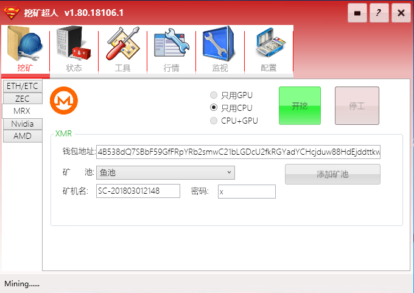

# 挖矿

## ETH/ETC挖矿

### ETH单挖模式

如果没有勾选双挖模式复选框，直接点击【开挖】，软件会进入ETH/ETC单挖模式。开挖前请务必填写好钱包地址并选择您所使用的矿池，矿机名也是必须填上的，不能为空。用户也可以根据需要添加自己的矿池。


### ETH/ETC双挖模式

勾选【双挖】复选框，填写自己相应的钱包地址，币种和矿池，矿池会根据用户对币种的选择变化。
**双挖强度这个选项的默认值是30%，用户可以根据自己的情况调整，值越大对第二币种挖矿强度越大，同时会影响到ETH/ETC本身的算力。**通过调整这个参数可以确保双挖状态下不会影响到主币ETH的挖矿算力。
>例子： 双挖强度30%的情况下，AMD rx480 显卡的以太坊ETH算力可以达到29MH/s，同时双挖Decred的算力为440MH/s。 如果把双挖强度设置成70%，则以太坊算力降到24MH/s，同时Decred的算力上升到850MH/s.

**NiceHash和ETH分叉币**
1.7版加入了对Nicehash以及ETH分叉币的支持，同时支持只用AMD显卡挖矿的模式。

**由于币种价值差异，我们建议大家首先确保主币种ETH的算力不下降的前提下进行双挖。**

- 可以进行双挖的币种有：Decred/Siacoin/Lbry/Pascal/
- 可以进行双挖的算法：Blake2s/Keccak
- 支持的显卡：AMD and NVIDIA


### ETH挖矿注意事项

【开机自动运行】勾选后，挖矿超人软件会在机器启动后自动运行，同时根据上一次挖矿的设置自动开始挖矿。该功能只支持ETH/ETC, 以及双挖模式。
#### 关于AMD显卡的矿机
- 比较久版本的AMD显卡（3xx系列），必须安装Catalyst (Crimson) 15.12驱动程序，否则有可能无法正常挖矿。
- 对于较新版本的AMD显卡4xx，5xx系列，可以使用最新的显卡驱动程序。
- 使用AMD显卡的用户请务必写入以下变量，已可以通过工具选项卡中的显卡参数一键设置。
   
    ```GPU_FORCE_64BIT_PTR 0
    GPU_MAX_HEAP_SIZE 100
    GPU_USE_SYNC_OBJECTS 1
    GPU_MAX_ALLOC_PERCENT 100
    GPU_SINGLE_ALLOC_PERCENT 100```

#### 其他注意事项
- 多GPU矿机请务必设置16G以上虚拟缓存。
- 目前挖以太坊ETH和以太经典ETC要求显存要有4G及以上，否则无法存储生成的DAG文件，没有办法挖矿。 

## ZEC零币挖矿

### Equihash 挖矿

普通开挖和高速开挖使用不同的挖矿内核，普通开挖的稳定性更高，高速开挖比普通开挖算力高2%左右，但是稳定性稍差。
> 高速开挖目前只支持NVIDIA显卡。


## XMR门罗币挖矿

### CPU挖矿

对于大多数显卡来讲，门罗币挖矿的收益是不如ETH和ZEC的。不过XMR有一个特点还是值得关注的。在主流的币种里，门罗币是极少的还能够使用CPU挖矿的。这主要还是由于其特殊的工作量证明机制。但是这种算法对内存的要求会比较高。**所以要挖门罗币的话，最好有12G以上的内存。**



### GPU挖矿

对于GPU挖矿来说，**要注意根据显卡本身的情况调整线程数量**，确保达到比较好的挖矿性能，同时保证稳定的运行。过高的线程数，不但不会增加性能，反而会使得稳定性下降，甚至会造成停止挖矿。

## Nvida显卡多币种挖矿

！[NVIDA](IMAGE/Nvidia.PNG)
内核采用ccminer，支持挖各种不同算法的山寨币。

## 系统自动重置

如果算力降到0(未启用算力预警)，或者低于设置的算力值(启用算力预警)，两分钟后开始预警，4分钟后重置系统-重启挖矿内核。
