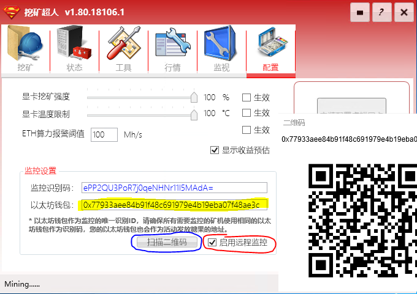
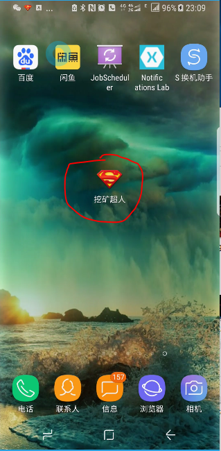
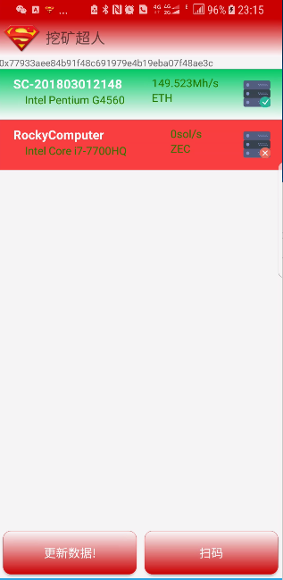
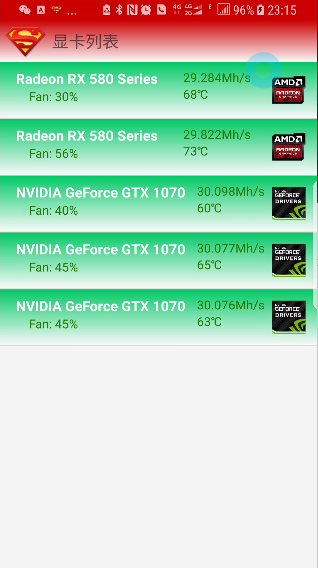
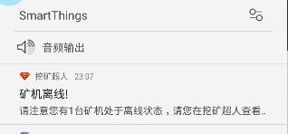

# 矿机远程监控

## 监控配置

- 挖矿超人软件会根据每台矿机的硬件信息生成唯一的机器识别码，作为矿机的ID，在配置选项卡可以看到，这个编码自动生成不能够更改。
- 用户需要输入一个以太坊钱包最为矿工的唯一识别码，请在所有需要监控的矿机上使用相同的钱包地址，这样所有设置了远程监控的矿机都会在监控客户端显示出来，同时这个以太坊钱包地址以后会作为活动发放糖果的地址，请一定要填写正确。
- 输入好以太坊钱包地址后，勾选【启用远程监控】，以开启监控功能。
- 点击扫描二维码，会弹出一个二维码图片，这张二维码是根据输入的以太坊钱包地址生成的，扫码后客户端就可以监控矿机的状态了。

## 移动端监控App

- 挖矿超人监控客户端现在提供Android版，可以在软件下载链接找到安装包。
- 打开监控APP后，首先需要扫码绑定唯一ID，绑定后只要是设置相同以太坊钱包地址的矿机都能够监控。
- 监控可以看到当前挖矿的算力，币种，状态以及详细的每张显卡或者设备的状况。
- 如果有矿机离线，会发出通知到手机通知信息栏。

绿色的是正常状态，红色为离线状态

矿机中显卡的详细列表

矿机离线通知