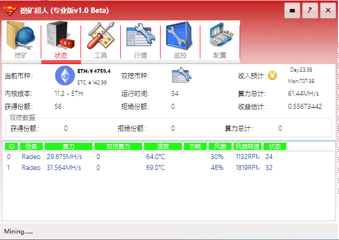
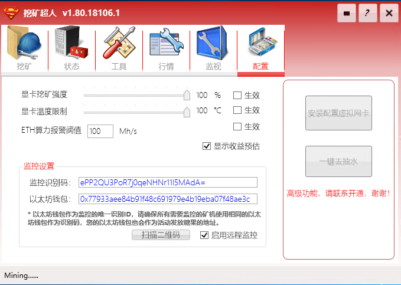

# 其他功能介绍

## 状态

通过状态界面，用户可以查看程序当前运行的状态，同时根据本次运行时间，全网算力数据和用户的算力计算出本次挖矿估计收益。在界面上可以看到当前正在挖的币种，运行时间和获得的份额数。下面的详细列表是当前矿机中运行的每个GPU的状态。



## 工具

在工具页面有以下几个功能：
1. 显卡参数设置：自动运行并设置以下参数

	```GPU_FORCE_64BIT_PTR 0
    GPU_MAX_HEAP_SIZE 100
    GPU_USE_SYNC_OBJECTS 1
    GPU_MAX_ALLOC_PERCENT 100
    GPU_SINGLE_ALLOC_PERCENT 100```
2. GPU信息显示：显示当前矿机的GPU信息。
3. 一键修复：由于杀毒软件会误杀各种挖矿内核，造成挖矿超人软件无法运行，该功能用于恢复内核文件并重置软件功能。关于软件安全性的问题请参考**软件安全性**一节
4. 设置16G缓存：多显卡矿机请务必设置足够的虚拟缓存，以保证挖矿正常进行。


## 实时行情显示

勾选开启实时行情后会实时显示各电子货币实时行情信息


## 运行配置

- 用户可以根据各自的情况设置显卡挖矿强度和温度限制，勾选生效后点开始挖矿会按照设置挖矿。
- 远程监控功能正在全力开发中，敬请期待...

