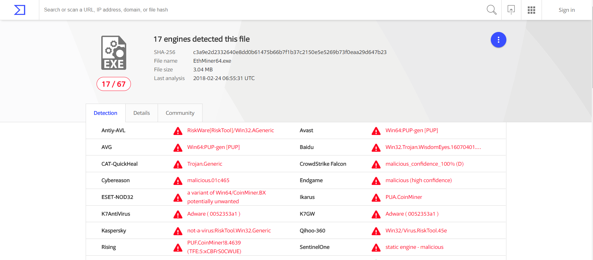

# 挖矿超人软件安全性声明

## 软件安全性扫描结果：

本人承诺挖矿超人不含任何病毒和木马程序。下图是本软件主程序在*[VirusTotal.com](www.virustotal.com)*上的恶意软件扫描结果：
**7/66**. 66种杀毒软件只有7种报告问题。 报告问题的7个杀毒软件其中有四个是报告挖矿软件 `Coinminer `； 两个是非病毒，未识别的工具软件`not-a-virus:RiskTool.Win32.Generic `。所以挖矿超人程序的安全性情各位矿工放心。

## 为什么防病毒软件会报病毒：

我们使用数款被广泛使用和接受的第三方的挖矿内核进行电子加密货币挖矿。但是这些挖矿内核容易被识别为恶意软件，相信有经验的矿工朋友都有这样的经验。以最著名的ETH双挖Claymore内核为例：
>v11版本 **17/67**；

>v10.6版本 **19/66**

Claymore作者本人的解释：
>I write miners since 2014. Most of them are recognized as viruses by some paranoid antiviruses, perhaps because I pack my miners to protect them from disassembling, perhaps because some people include them into their botnets, or perhaps these antiviruses are not good, I don't know. For these years, a lot of people used my miners and nobody confirmed that my miner stole anything or did something bad. 
>我从2014年就开始写挖矿程序了。 绝大多数都会被偏执的杀毒软件识别为病毒，也许是因为我为了防止程序被破解，过度加壳的原因。也许是有人把它归类于僵尸网络。当然也有可能杀毒软件本省就是不好使：）。这些年来很多热呢用了我的挖矿软件，没有人报告它们有任何恶意行为。

## 应对方案

### 方法一，关闭杀毒软件：
*不推荐，网络世界太复杂，小心驶得万年船。* 
### 方法二，加入杀毒软件的白名单：
把内核文件加入杀毒软件的白名单，以下以360杀毒软件为例

1. 选择查看隔离文件

2. 选择恢复

3. 恢复并加入白名单

最后还是引用Claymore作者的话结尾吧：
>If you think that I write viruses instead of good miners - do not use this miner, or at least use it on systems without any valuable data.

>如果你认为我是在写病毒，而不是一个优质的挖矿程序 - 请不要使用这个挖矿软件，或者不要用在保存有重要数据的系统上。

**最后我想说：矿工的利益和我们挖矿软件作者的利益是一致的，Enjoy！！**